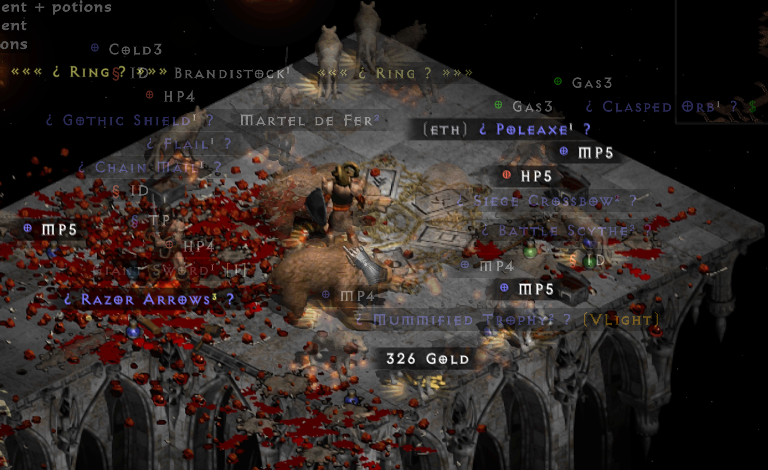
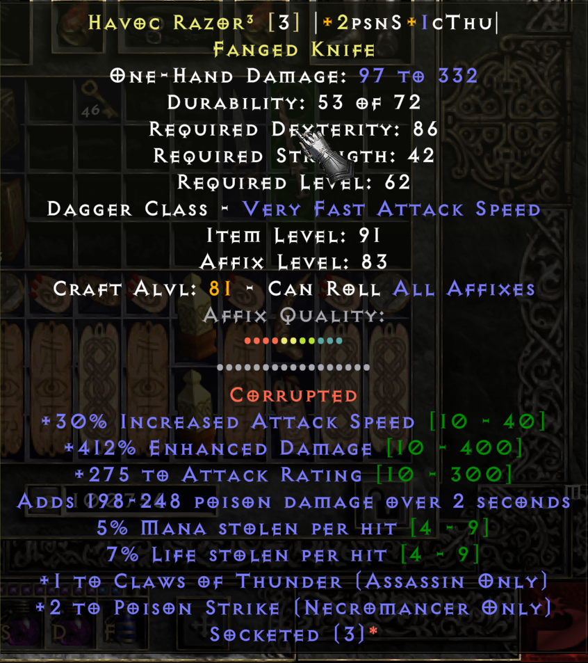
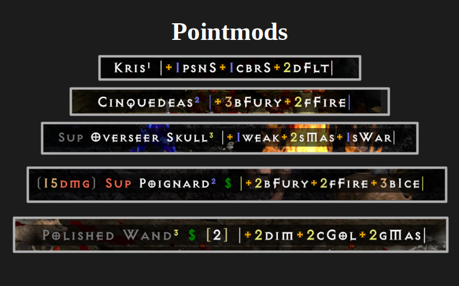
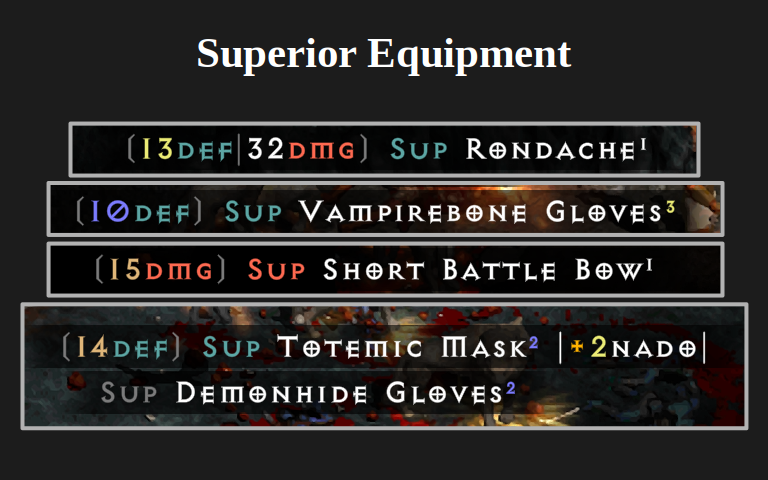

# Loot Goblin PD2 Loot-Filter



This filter was originally forked from [Kryszard's PD2 Loot Filter](https://github.com/Kryszard-POD/Kryszard-s-PD2-Loot-Filter), and still uses Kryszard's code for some features. Please see the documentation there regarding features not described here, and the section on attribution at the end of this readme for details. Thank you, Kryszard, for all your good work.

# Installation

Download Loot_Goblin.filter from this repository to [your PD2 Directory]/filters/local. Then, from your PD2 launcher, navigate to "Item Filter Profiles" and select it from the Local Filter category.

# Building from source

The generation pipeline is written in Python3, and requires the PySat (python-sat) library. The machine learning algorithms used to calculate maximum point values take ~10 minutes to run on my 12 core processor, and just over 1 hour when running on a single thread.

```
git clone https://github.com/PreyInstinct/Loot-Goblin-Filter.git
pip install -r requirements.txt
python3 build_filter.py [target.filter] --verbose
```

# About

This filter is in a beta state. Some features may not be fully polished, and vestiges of obsolete features may linger. I will be refining the filter as I encounter inadequacies, and welcome bugs reports and feedback. Expect frequent updates during the early part of the season.

## Points



The main feature this filter introduces is a visual point-based system for randomly generated item types (magic, rare, and crafted.) This feature is designed to help you quickly sort out loot that might have some use or value from Charsi food. It is not intended to accurately assess the value of items or call out GG gear, but merely to signal if the full item description is even worth looking at.

A point represents a well rolled affix - either a rare/highly sought after affix, a high roll on a desireable affix, or both. Not all points are equal, though I try to weight the most desireable affixes higher by making them worth multiple points, nor are points equivalent between item classes. The gray row of points shows you the maximum possible number of points (not including corruptions) for an item of a given type.

Points are color coded by their broad utility class. Since you are usually trying to min-max your build, lots of the same or similar colored points will probably be better than "rainbow" arrays, but if something has a lot of points of any color on it you should probably take a look and assess for yourself.

|Category           |Color      |Description                                 |
|-------------------|-----------|--------------------------------------------|
|Etherealness       |Gray       |Ethereal w/ repair/indestructable           |
|Physical Damage    |Red        |% ED and flat min/max                       |
|Damage Effects     |Coral      |CB, DS, wounds, Amp Dmg proc, etc           |
|Elemental Damage   |Orange     |Flat, mastery, pierce, Lower Res proc, etc  |
|Skills             |Gold       |Skill bonuses and combos                    |
|Speed              |Yellow     |IAS, FHR, FCR, FBR                          |
|Statistics         |Dark Green |Str, Dex, Vit, Ene                          |
|Other              |Sage       |AR, pierce, tele charges, etc               |
|HP/MP              |Teal       |HP/MP, LL/ML, LaeK/MaeK                     |
|Physical Protection|Blue       |Defense, Block, & PDR                       |
|Magic Protection   |Purple     |Resistances & Magic Damage Reduced          |

## Configurable Features

The point system and other features are configurable with the tab-separated ".csv" text files. I recommend opening these in a spreadsheet program like LibreOffice Calc or Microsoft Excel. The headers are just for human convenience and fields are hardcoded by column order, so don't go shuffling the columns about or creating new columns.

The point rules are built using a machine learning algorithm that automatically discovers classes of items which can have the same affixes and follow the same rules. For each class, all combinations of affixes for magic, rare, and crafted items are exhaustivly searched to determine the maximum number of points possible for that item class. This makes modifying my point system or creating your own point system relatively simple, and I hope other filter authors will use this engine to add point sytems to their own filters.

### Point System Config Files

`config/points.csv` Is the main file for adjusting point values.
 - "Item Code": Filter syntax conditional statement you would use for creating an ItemDisplay rule.
 - "Item Description": Human readable equivalent. Optional - not used internally.
 - "Quality Requirements": Additional syntax conditionals that determine when a point is awarded, but does not create new classes of items. Designed to allow points for self-repair to apply only when an item is ethereal, but could also be used to encode other combos (e.g. High ED + Amp Proc = 2 bonus points).
 - "Stat": Filter syntax attribute code or sum of attributes (e.g. STR+DEX). The vocabulary here must be *exactly* the same as the vocaulary used in `prefixes.csv`, `suffixes.csv`, and `crafting.csv`. So, for example, you must use the "STR" alias instead of "STAT0". When such synonyms exist, check the affix config files to see which version to use. In general, I tried to only use the named attribute codes, except for FOOLS.
 - "Stat Description": Human readable equivalent. Optional - not used interrnally.
 - "Point Color": One of the valid colors described in the filter documentation.
 - "Point Category": Human readable classifier. Not currently used internally.
 - "Thresholds": A tab separated list of the thresholds at which to award points. The resulting conditions will be of the form "STAT>T" for each threshold value. You can include the same threshold multiple times to award multiple points.

`data/prefixes.csv`, `suffixes.csv`, and `crafting.csv`: Contain information regarding the highest level affixes possible. Redundancy is removed as much as possible, as build time increases exponentially with the number of affixes to search through, especially when there aree multiple affixes in the same group. Editting these files has the potential to break things in exciting ways with minor errors, so 
do so with care. Let me know if something needs correction or updating and I will try to update these files.
 - "Affix": The affix name. Maintained just for human readible attribution/debugging. These names don't show up in the final filter.
 - "Affix Item Types": Categories as they appear on the Affixes wiki page. Human readable for convenience only.
 - "Filter Definition": Filter sytax conditional used to define the items the affix can apply to. All terms must be defined in the `item_groups_*.csv` config files; you cannot use aliases here unless they are added there. Typos will result in exciting errors.
 - "magic only": 1 if the affix can only apply to magic items, 0 or blank if it can apply to rares and crafts.
 - "group": The item group. Correct groups are essential.
 - "Stat": Filter syntax attribute code/s. Multiple attributes from the same affiixx should be separated with semi-colons (e.g. STAT123;STAT121 for AR and ED to Undead). This vocabulary must match exactly with the vocabulary used in `points.csv`.
 - "Min Value": Not currently used, but maybe will be used for future features.
 - "Max Value": The maximum value possible for "Stat", separated with ";" for multiple stats.
 - "Attribute Description": Human readable affix description. Not used internally but some value is mandatory to prevent parsing errors.

`data/item_groups_composites.csv` Defines item descriptors that are subsets of combinations of other descriptors. E.g. Amazon Weapons (ZON) is a category composed of part of spears, javelins, and bows (SPEAR OR JAV OR BOW). The left-most term is contained entirely within all terms to the right.

`data/item_groups_subsets.csv` Defines item groups which are strict subsets of other groups. 1 if the group from row i is a subset of the group from column j, 0 or blank otherwise. Values above the diagonal (marked with "x"s) are not used, so ordering matters (supersets should always precede subsets).

`data/item_groups_disjoint.csv` Defines item groups which are entirely disjoint (non-overlapping), through the inverse relationship (null values signify disjointness). 1 if any item exists that is both a member of row i and column j, 0 or blank otherwise. Values above the diagonal are not used (would be symetric anyways).

### Other Config Files

`config/style.csv` Allows you to edit the general appearance of item names, including brackets unidentified items or GG drops etc, text colors, and tags before and after the name. Organized into blocks - do not delete or edit the block headers or the file won't parse correctly. You can add or remove additional lines to the blocks, however.
- "Brackets" section is used to set any characters or formatting that comes to the left and right of item names, such as for unidentified items. The marker levels correspond to the "Marker Level" column of `hiding_highlighting.csv`.
- "Name Colors" allows you to change the color of broad classes of items, if you don't like the default colors. The first field is the conditional statement in filter syntax, and the right should be a color code (though really any valid filter syntax code will work).
- "Right of Name" sets tags that appear to the right of the item name. The first field is a filter syntax conditional statement to apply the tag to, and the second field is the filter syntax tag. The tag appears immediately after tha name, so include leading spaces if you want.
- "Left of Name" is just like "Right of Name", except to the left. Trailing spaces are trimmed from the tag, so a single space is hardcoded inbetween the tag and the rest of the name.

`config/sets_and_uniques.csv` Defines tier values for set and unique items. Blank fields indicate "D" tier, on a scale from "F" to "S". Lower tier sets and uniques will have less highlighting/notification, and at high filter levels low tier uniques will be filtered out. The name values here are displayed for unidentified items, so you can create a version without revealed sets & uniques by replacing the names with %BASENAME%.

`config/skills.csv` Defines the relationship between classes, skill trees, and skills; skill name abbreviations; and primary, support, and niche skills. Primary skills are given increased emphasis when they appear as pointmods.

`hiding_highlighting.csv` Defines when certain items are hiden, notified, and given map markers.
- "Rarity": Rarity conditional codes (i.e. NMAG, MAG, RARE, CRAFT, SET, UNI, RW).
- "Property": NMAG properties (i.e. SUP ETH INF NORM EXC ELT)
- "Group": Item groups (e.g. ARMOR, CLUB, amu). Some of these use build-level aliasing (e.g. "${alias}") defined in `aliases.py`.
- "Descrition": Human readable group description for convenience.
- "Filter Level": The filter level at which the category will start to be filtered. Odd filter levels are reserved for toggling potions on/off, so the actual filter level will be twice the value here.
- "Marker Level": The size of the map marker when this group is notified, from 0 (no marker) to 4 (largest marker), as well as the degree of bracketting used to highlight the item name. Ranks 5-7 all use DOT size markers, and have alternative purple bracketting for charms and jewels.
- "Notification Level": The filter level at which the category will no longer be notified, from 0 (never notify) to 5 (always notify). Odd filter levels are reserved for toggling potions on/off, so the actual filter level will be twice the value here.

### Advanced Aliasing

Aliases are defined in aliases.py as Python string variables. They can be called in the filter source using "${ALIAS}", and will be substitued with the string value at build time.

This is very similar to the filter's Aliasing functionality, but is significantly more flexible. First, these Python-level aliases may be nested inside each other (e.g. QUIVER = "(${ARROWS} OR ${BOLTS})" without breaking. Second, this extends aliasing functionailty with Python so that aliases could be composed dynamically.

If you want to use this functionality for your own filter, `aliases.py` should be portable and fairly self-evident. Also grab the top level script `build_filter.py` if you don't want to implement your own pipeline. Just edit the "structure" and "file_header" in `build_filter.py` to point to your source filter file/s and define your aliases in `aliases.py`. Variables in the global namespace of `aliases.py` will not be used as aliases if they start with an underscore `_`.

## Item Tier Superscripts

Normal Item<sup>1</sup>
Exceptional Item<sup>2</sup>
Elite Item<sup>3</sup>

## Skill Tags (Pointmods)



While generally very good, I have re-worked Kryszard's pointmod tags to suit my preference. In general, my aims have been to 1) improve legibility, 2) show more information while using as litte additional space as possible, and 3) extend the usefulness of this feature to magic, rare, and crafted item hunting in addition to picking bases.

### Inclusion of Skill Trees

Class-focused items don't have all +ALLSK, +CLSK (e.g. Paladin Skills), or +TABSK (e.g. Combat Skills) automods, with the exception of Amazon bows, which don't have +SK (single skill) automods, so there is no need to worry about these mods when hunting for bases. However, magic and rare items that combine +TABSK and +SK can be quite useful. Kryszard's approach to these is to add a "+High Skill Roll" tag on these items, which is quite reasonable considering these mods can't be seen until IDed. I like having this information in a consistent place (the name line), though, so I've opted to include them.

### New Skill Abbreviations

I personally find the three letter skill abbreviations a bit obtuse. I think there are just too many skills, with many of them having very similar names, for a three letter system to be legible. I have thus implemented a slightly more complex, but hopefully more legible and intuitive system.
 - All Skills is ALL(caps).
 - Acronyms are also in ALLCAPS. E.g. SS (Shape Shifting), BO (Battle Orders), CDM (Claw & Dagger Mastery), ES (Energy Shield).
 - Bonuses to skill trees (including CLSK and TABSK) use Proper Capitalization E.g. Cries, Cold, JvSp, Mast.
 - Single skill bonuses (that aren't acronyms) use camelCaps. E.g. fOrb, maul, zerk, bFury.
 - Where possible, skills that have common words in the same tree are shortened as much as possible and always in the same way. E.g. Assasin "Dragon" skills are dTal, dClaw, dTail, and dFlt, while Amazon "Arrow" skills are magA, firA, colA, expA, iceA, gudA, immA, and frzA, and "Strike" skills are powA, chgS, litS, tigS, cbrS, PhoS, psnS.
 - Some simple skills are named after their primary affect, rather than the actual skill name. E.g. +def, +hp, +spd, +res, and bleed for Barb masteries, and +AR for Amazon's Penetrate.

See `config/skills.csv` for the full list of abbreviations.

## Color Coding

Many tags use the D2 rarity colors, including skill bonuses, superior ED bonuses, and more. For example, for skill bonuses +1 is rendered blue, +2 is rendered yellow, and +3 or higher is rendered gold. Simlarly, the skills themselves use the D2 rarity colors: single skills are white, skill tabs are blue, class skills are yellow, and all skills is gold.



Misc items also use new colors to distinguish them: red for item modification (e.g. WSS, Puzzlebox), sage for map modification (e.g. Standard of Heroes), purple for boss keys or portals, tan for new utility items (e.g. Horadric Almanac), and orange for crafting related items (e.g. infusions).

## Gold and Sellables

I dramatically increased the thresholds at which gold piles will be visible compared to Kryszard. I also removed the detailed sell value tags and replaced them with a simple $ when an item sells for >90% of the max sale price. These tags only show up on small (2 square) items, as picking up larger items is dramatically less efficient. The $ tag will also show up on unidentified small items that are likely to have a max sale price.

## Revealed Unique Names

The names of unidentified unique items will also show up when possible, as in some other filters.

## Attribution

The following sections remain as is, with only minor edits, from Kryszard's loot filter (currently ~36% of the final filter):
- charms.filter
- freeze_notes.filter
- gambling.filter
- gems.filter
- imbuing_notes.filter
- map_notes.filter
- navigation.filter
- nonmagic_mods.filter
- runes.filter
- shop_hunting.filter
- socketing_notes_mag.filter
- socketing_notes.nmag.filter
- unknown_items.filter
- upgrade_notes.filter

The following sections are substantially edited versions of Kryszard's loot filter (currently ~4% of the final filter):
 - crafting_notes.filter
 - gold_sellables.filter
 - jewel_notes.filter
 - key_info.filter
 - misc_items.filter
 - scrolls_potions.filter
